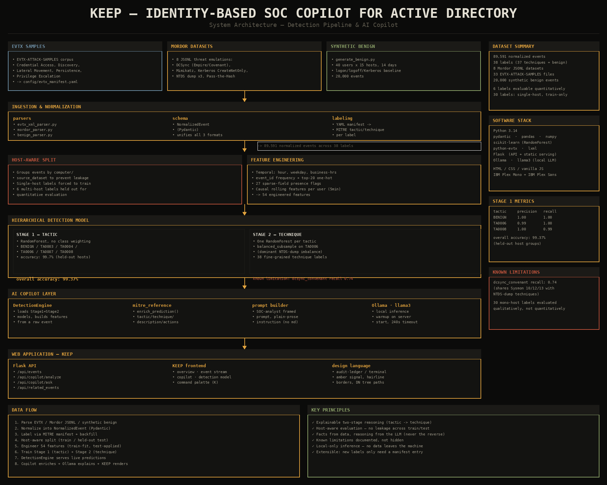

# KEEP — Identity-Based SOC Copilot for Active Directory

Detection pipeline + local AI copilot for identity-based attacks against Active Directory. Built around two goals: detect credential-access and lateral-movement techniques from real Windows Security / Sysmon telemetry, and make every detection immediately understandable to a SOC analyst through a locally-running AI copilot.



## Contents

- [Overview](#overview)
- [Pipeline](#pipeline)
- [Detection model](#detection-model)
- [AI copilot](#ai-copilot)
- [Web application](#web-application)
- [Known limitations](#known-limitations)
- [Project structure](#project-structure)
- [Setup](#setup)
- [Future work](#future-work)

## Overview

| | |
|---|---|
| **Dataset** | 89,591 normalized events - 38 labels (37 MITRE techniques + benign) |
| **Sources** | EVTX-ATTACK-SAMPLES (33 files) - 8 Mordor JSONL threat emulations - synthetic benign baseline (20,000 events) |
| **Model** | Two-stage hierarchical RandomForest - tactic first, technique second |
| **Accuracy** | 99.37% on held-out, host-disjoint test split (6 quantitatively evaluable labels + benign) |
| **Copilot** | Local LLM (Ollama / llama3) grounded in real predictions - no fabricated facts |
| **Frontend** | KEEP - a dark, terminal/audit-ledger styled web app (not another generic AI-SaaS dashboard) |

## Pipeline
Three independent sources feed the pipeline, each with its own parser (`src/ingestion/`) since none share a native format. A single `NormalizedEvent` Pydantic schema unifies them before labeling, via a YAML manifest (`config/evtx_manifest.yaml`) plus a manual MITRE mapping for the Mordor datasets, which don't carry manifest metadata natively.

**Data leakage note:** 30 of the 37 attack labels in this dataset are tied to a single host - a direct consequence of using single-capture public datasets. The split (`src/modeling/train_test_split.py`) groups events by host and forces single-host labels entirely into training rather than letting a naive random split leak hostnames into the test set. Only 6 labels (plus benign) end up genuinely evaluable on disjoint hosts; the rest are trained on but validated qualitatively rather than with a held-out metric.

## Detection model

Two stages rather than one flat 38-class classifier, mirroring how an analyst actually triages: *what kind of activity is this* (MITRE tactic) before *which specific technique*.

**Stage 1 - tactic** (`src/modeling/train_hierarchical.py`)

| Tactic | Precision | Recall |
|---|---|---|
| BENIGN | 1.00 | 1.00 |
| TA0006 - Credential Access | 0.99 | 1.00 |
| TA0008 - Lateral Movement | 1.00 | 0.99 |

**Stage 2 - technique** (one RandomForest per tactic)

| Technique | Precision | Recall |
|---|---|---|
| pass_the_hash | 1.00 | 1.00 |
| mimikatz | 1.00 | 0.99 |
| dcsync_empire | 1.00 | 0.96 |
| kerberos_createnetonly | 1.00 | 0.94 |
| dcsync_convenant | 1.00 | 0.74 |

Stage 1 is trained **without** class weighting - an earlier version used balanced weights, which caused the two smallest tactics (68 and 85 samples) to over-trigger and misroute real Credential Access / Lateral Movement events. Stage 2 for TA0006 **does** use `balanced_subsample`, since its imbalance (NTDS-dump techniques at 11k-17k events vs. `dcsync_convenant` at 740) is real but milder.

## AI copilot

`src/copilot/` bridges the trained models to a locally-running Ollama model:

- **`model_inference.py`** - `DetectionEngine`, loads both stages and the frozen encoders, turns one raw event into a prediction.
- **`mitre_reference.py`** - enriches a prediction with tactic name, technique code, description, and recommended first actions.
- **`ollama_client.py`** - generates the analyst-facing explanation from a structured SOC prompt (explicit no-markdown instruction for clean rendering).

**Design principle:** verifiable facts (event IDs, timestamps, confidence, correlated events) always come from the real dataset - never from the LLM. Early testing showed the LLM fabricating plausible-sounding but fake event IDs when asked for "related events"; that lookup now queries the dataset directly (same host, +/-5-minute window) instead of asking the model to imagine an answer.

## Web application

`web/index.html` (frontend) + `api_server.py` (Flask backend). Deliberately avoids the common "AI SaaS" visual template - instead grounded in the subject itself: Active Directory is a literal tree (rendered as DN-style breadcrumbs), and SOC tooling descends from monochrome-terminal ops rooms (flat panels, hairline borders, monospace-forward, single muted-amber accent).

Views: **Overview** (live stats, event stream, tactic distribution) - **Event Stream** (filterable table) - **Copilot** (detection detail, confidence gauge, chat) - **Detection Model** (Stage 1/2 metrics, documented limitations).

Run with:
```powershell
pip install -r requirements.txt flask
python api_server.py
```
then open `http://localhost:5000`. If Ollama isn't running, the frontend degrades to a clearly-labeled static demo mode instead of failing.

## Known limitations

- **`dcsync_convenant` recall (0.74):** shares Sysmon event IDs 10/12/13 with the NTDS-dump techniques - both are Sysmon telemetry of process/memory access, and the current feature set can't fully separate them. Precision stays 1.00 (never misclassified as benign).
- **30/38 labels are single-host:** trained on, but not quantitatively testable given the dataset's single-capture nature. Validated qualitatively against expected event-ID signatures instead of a held-out metric.

## Project structure
## Setup

```powershell
python -m venv .venv
.venv\Scripts\activate
pip install -r requirements.txt

# 1. Build the dataset from raw sources
python -m src.cleaning.build_dataset config\evtx_manifest.yaml data\raw\evtx_selected data\raw

# 2. Host-aware train/test split
python -m src.modeling.train_test_split

# 3. Feature engineering
python -m src.features.feature_engineering

# 4. Train the hierarchical model
python -m src.modeling.train_hierarchical

# 5. Run the web app
pip install flask
python api_server.py
```

Ollama with `llama3` pulled (`ollama pull llama3`) is required for the AI copilot to generate live explanations; without it, the app runs in static demo mode.

## Future work

- Parse additional raw Sysmon fields (`Image`, `TargetImage`, `CallTrace`) to resolve the `dcsync_convenant` / NTDS-dump overlap at the feature level.
- Broaden the evaluable label set with additional multi-host captures.
- Retrieval-augmented explanations grounded in MITRE ATT&CK docs and past incident write-ups.
- Multi-step LangGraph orchestration for more complex analyst workflows.
- Authentication / RBAC ahead of any shared deployment.
